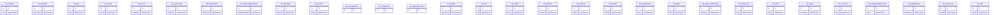



# SimpleTablesMultipleData

```mermaid
erDiagram
    Tbl_BIGINT {
      
      int ID 
      
      long DataColumn 
    
    }
    Tbl_BINARY {
      
      int ID 
      
      byte-Array DataColumn 
    
    }
    Tbl_BIT {
      
      int ID 
      
      bool DataColumn 
    
    }
    Tbl_CHAR {
      
      int ID 
      
      string DataColumn 
    
    }
    Tbl_DATE {
      
      int ID 
      
      DateTime DataColumn 
    
    }
    Tbl_DATETIME {
      
      int ID 
      
      DateTime DataColumn 
    
    }
    Tbl_DATETIME2 {
      
      int ID 
      
      DateTime DataColumn 
    
    }
    Tbl_DATETIMEOFFSET {
      
      int ID 
      
      DateTimeOffset DataColumn 
    
    }
    Tbl_DECIMAL {
      
      int ID 
      
      decimal DataColumn 
    
    }
    Tbl_FLOAT {
      
      int ID 
      
      double DataColumn 
    
    }
    Tbl_GEOGRAPHY {
      
      int ID 
    
    }
    Tbl_GEOMETRY {
      
      int ID 
    
    }
    Tbl_HIERARCHYID {
      
      int ID 
    
    }
    Tbl_IMAGE {
      
      int ID 
      
      byte-Array DataColumn 
    
    }
    Tbl_INT {
      
      int ID 
      
      int DataColumn 
    
    }
    Tbl_JSON {
      
      int ID 
      
      string DataColumn 
    
    }
    Tbl_MONEY {
      
      int ID 
      
      decimal DataColumn 
    
    }
    Tbl_NCHAR {
      
      int ID 
      
      string DataColumn 
    
    }
    Tbl_NTEXT {
      
      int ID 
      
      string DataColumn 
    
    }
    Tbl_NVARCHAR {
      
      int ID 
      
      string DataColumn 
    
    }
    Tbl_REAL {
      
      int ID 
      
      float DataColumn 
    
    }
    Tbl_SMALLDATETIME {
      
      int ID 
      
      DateTime DataColumn 
    
    }
    Tbl_SMALLINT {
      
      int ID 
      
      short DataColumn 
    
    }
    Tbl_TEXT {
      
      int ID 
      
      string DataColumn 
    
    }
    Tbl_TIME {
      
      int ID 
      
      TimeSpan DataColumn 
    
    }
    Tbl_TINYINT {
      
      int ID 
      
      byte DataColumn 
    
    }
    Tbl_UNIQUEIDENTIFIER {
      
      int ID 
      
      Guid DataColumn 
    
    }
    Tbl_VARBINARY {
      
      int ID 
      
      byte-Array DataColumn 
    
    }
    Tbl_VARCHAR {
      
      int ID 
      
      string DataColumn 
    
    }
    Tbl_XML {
      
      int ID 
      
      string DataColumn 
    
    }
```
